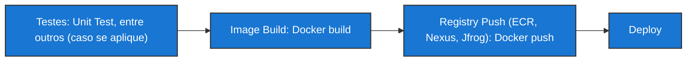

#infraestrutura/devops/containers/container/docker #infraestrutura/devops/containers/container #infraestrutura/devops

## Development

A lógica por trás do desenvolvimento, é baseada na necessidade de isolamento de múltiplos serviços para causas diversas (ex.: Testes de _backend_ (ex:. _Ruby_), testes de _frontend_ (ex.: _ReactJS_) e testes de _database_ (ex.: _PostgreSQL_)), por parte do desenvolvedor. Importante ressaltar que é possível criar uma _network_ para que estes componentes isolados possam comunicar entre si. Isso é muito simplificado através do uso de uma aplicação dentro do _Docker_, chamada de _Docker Compose_, para realizar a composição de uma aplicação. Isso facilita o processo, pois através desta abordagem, os passos de _build / run_ individual para cada _container_ se tornam desnecessários, permitindo que através de um arquivo declarativo, o ambiente seja automaticamente colocado em funcionamento através de um único comando da aplicação _Docker Compose_ (veja os exemplos abaixo).

> Para provisionar ambientes de desenvolvimento: 

```shell
docker-compose up
```

> Para destruir ambientes de desenvolvimento:

```shell
docker-compose down
```

Importante ressaltar que o fato de as imagens possuírem o pilar da ***imutabilidade***, permite com que os comandos da aplicação _Docker Compose_ nunca se alterem. Ou seja, a imagem ficará no armazenamento secundário da máquina do desenvolvedor, permitindo que o mesmo execute o comando de _down_ no _Docker Compose_ para destruir os _containers_ provisionados no ambiente e, logo no outro dia, execute o comando de _up_ para provisionar novamente todos os _containers_ que estavam provisionados anteriormente para a continuidade no seu projeto.

## Continuous Integration (CI)

Assim que o desenvolvedor tem segurança na versão do seu código da aplicação que foi desenvolvida, ele naturalmente irá realizar um _commit_ para o _Git_ (_GitHub/GitLab/GitTea/BitBucket_), que será o **SCM** (_Source Code Management_). Este processo inicial dará início à uma nova _pipeline_, também conhecida como _CI_ (_Continuous Integration_), onde serão encontrados os processos de forma automatizada, por meio de ferramentas como _Jenkins, GitLab, GitHub Actions, Drone_, entre outras. O _CI_ será composto dos seguintes passos subsequentes:




1. Testes: _Unit Test_, entre outros (caso se aplique)
2. Image Build: _Docker build_
3. Registry Push (_ECR_, _Nexus_, _Jfrog_): _Docker push_
4. Deploy

```ad-tip
O Registry é um servidor remoto que armazena as Docker Images e quaisquer tipos de artefato (ex.: manifestos)
```


## Continuous Delivery (CD)


Após os passos realizados nas etapas de _CI_, partiremos para as etapas de _CD_ (_Continuous Delivery_). Tendo em vista que _deploy_ já foi realizado, será necessário alguma solução de orquestração para que sejam realizadas as etapas de _Continuous Delivery_ como, por exemplo, _Kubernetes (K8s), ECS, Docker Swarm_, etc..

O funcionamento se baseia em VMs/instâncias que estarão sendo _nodes_ contendo em si os _containers_ (no contexto do _K8s_, este seria o comportamento de um _Pod_!).

Quando o _deploy_ já foi realizado, as _Docker Images_ naturalmente já estão no _Registry_. Então, a partir do _Registry_, são coletadas as _Docker Images_ e distribuídas para os _clusters_ em forma de _containers_, de acordo com o exemplo abordado com _K8s_.

