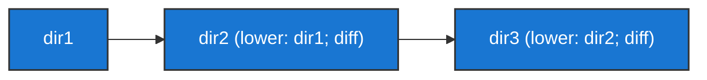
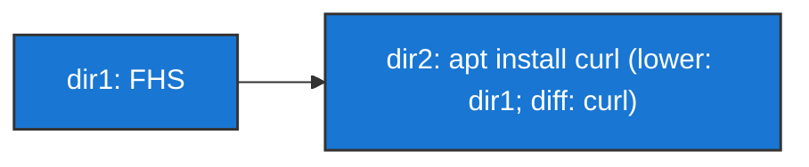

#infraestrutura/devops/containers/container/docker #infraestrutura/devops/containers/container #infraestrutura/devops

O OverlayFS é um sistema de arquivos (File System) do Linux, que o Docker implementa em seus processos (gerenciamento de criação de camadas, por exemplo).

Todas as ações geradas sobre o Docker realizam criações de camadas, que se abstraem em diretórios no path _/var/lib/docker/overlay_. A junção de todos estes diretórios dão origem ao diretório raiz do container. Um ponto crucial é relembrar que os diretórios seguem uma ordem de preferência, sendo que o mais alto sempre terá maior preferência sobre os demais.

```ad-important
É importante salientar a importância do diretório localizado em _/var/lib/docker_, pois é neste local onde o Docker irá realizar todo o seu armazenamento. O que significa que, em ambientes de produção, este diretório deve ser incluído como um mountpoint no arquivo _fstab_ do sistema operacional do servidor, preferencialmente utilizando de algum disco isolado para servir de armazenamento mais adequado em tamanho e em segurança para os containers Docker.
```


## Funcionamento organizacional do OverlayFS


Cada camada possui a referência para sua camada pai. Exemplo:



Onde:

* lower: é o que indica o diretório pai do diretório target;
* diff: é o que indica a diferença entre o diretório target e seu diretório pai.

Uma forma de exemplificar estes indicadores, seria como exibido abaixo:


