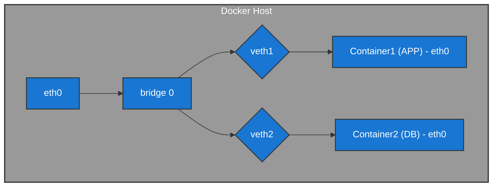
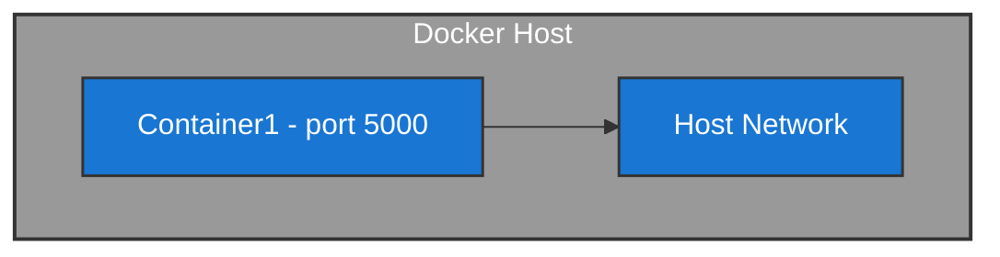
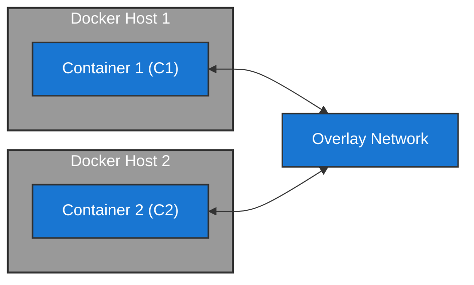

#infraestrutura/devops/containers/container/docker #infraestrutura/devops/containers/container #infraestrutura/devops #infraestrutura/network

Existem 3 tipos principais de networking no Docker:

1. Bridge:

Neste cenário, o **Docker Host** executa o _docker daemon_ e possui uma interface de rede física chamada **_eth0_**. Essa interface se conecta a uma **interface bridge** (a **bridge 0**), que permite a comunicação entre containers.

A **interface _bridge 0_** cria uma rede interna para os containers. Os **containers** não precisam de rotas externas para se comunicarem entre si, pois eles se comunicam diretamente por meio das interfaces **_veth1_** e **_veth2_** (interfaces virtuais de rede).

- **Container1 (APP)** está conectado à **_veth1_** e à **_eth0_** do container, comunicando-se com **Container2 (DB)** através de **_veth2_**.
    
- O tráfego de dados entre **Container1 (APP)** e **Container2 (DB)** pode ocorrer sem sair da rede interna da **bridge 0** no Docker Host.

2. Host (**Tipo não recomendado**):

Neste cenário, o **container** é executado no mesmo nível da **rede do host**. Ou seja, o **isolamento da aplicação (APP)** não é mantido, uma vez que o container está diretamente acessando a **rede do próprio host** para comunicação **bidirecional**. Essa comunicação é feita através de uma **porta específica** (neste caso, a **porta 5000**), permitindo que o container se conecte ao host e vice-versa.

- **Sem isolamento**: Nesse modelo, a aplicação dentro do container está praticamente "livre" para interagir com o host, utilizando sua rede. Isso contrasta com um modelo mais isolado, onde o container tem uma rede virtual separada.
    
- **Comunicação via porta**: O uso de **portas específicas** (como a **porta 5000**) permite a comunicação direta entre o container e o host, sem a necessidade de configurações complexas de rede.

3. Overlay (Docker Swarm)

A **rede overlay** no Docker é uma rede virtual que permite que containers, mesmo em **hosts diferentes**, se comuniquem entre si, criando um ambiente de rede unificado. O Docker usa o **driver de rede overlay** para configurar a comunicação entre containers em diferentes hosts, utilizando protocolos como VXLAN (Virtual Extensible LAN) para encapsular pacotes de rede. Vale lembrar que **esta rede é criada somente com o uso de Docker Swarm!**

- **Container 1 (C1)** no **Docker Host 1** está conectado à **rede overlay**, que permite comunicação com outros containers em diferentes hosts.
    
- **Container 2 (C2)** no **Docker Host 2** também está conectado à mesma **rede overlay**, permitindo que os dois containers se comuniquem entre si através dessa rede virtual, sem necessidade de configurar redes separadas em cada host físico.