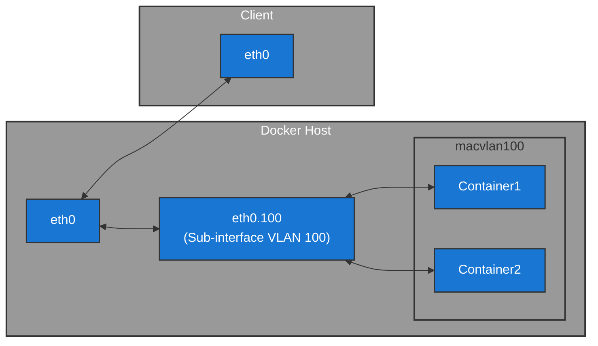

#infraestrutura/devops/containers/container/docker #infraestrutura/devops/containers/container #infraestrutura/devops #infraestrutura/network #infraestrutura/network/protocolo #infraestrutura/network/protocolo/macvlan

## Conceito: macvlan

O driver **macvlan** permite que containers no Docker sejam tratados como se fossem dispositivos físicos na rede, cada um com seu próprio **MAC address** e IP diretamente roteável na rede física (L2).

Diferente do bridge ou overlay, onde os containers compartilham o namespace de rede do host ou tunelam pacotes, o macvlan conecta containers diretamente à interface física do host, eliminando NAT e bridge local.

## Funcionamento técnico

1. **Criação de uma interface virtual (sub-interface)**:
    
    - O Docker cria uma sub-interface vinculada à interface física do host (ex.: _eth0_).
        
    - Essa sub-interface opera em modo **macvlan**, encapsulando os pacotes com um endereço MAC distinto do host.
        
2. **Endereçamento L2 isolado**:
    
    - Cada container recebe um **MAC address único**, registrado na tabela MAC dos switches físicos, como se fosse uma máquina real na rede.
        
3. **Roteamento e Broadcast**:
    
    - Containers participam da rede física no domínio de broadcast e collision domain (se estiver em hub ou rede sem switches inteligentes).
        
    - O tráfego é roteado diretamente pelos switches físicos da rede, sem intervenção do host, exceto pela interface física em si.
        
4. **Namespace de rede separado do host**:
    
    - O host **não consegue se comunicar diretamente** com os containers na rede macvlan, pois eles estão isolados no namespace L2.
        
    - Solução padrão: criar uma sub-interface macvlan adicional no próprio host (modo bridge) para permitir comunicação entre host e containers.

## Modos de operação

- **Bridge mode** (mais comum):  
    Containers se comunicam entre si e com a rede física. A sub-interface é uma ponte entre containers e rede externa.
    
- **Private mode**:  
    Containers se comunicam apenas entre si, sem acesso à rede física.
    
- **VEPA mode (Virtual Ethernet Port Aggregator)**:  
    Pacotes destinados a outros containers são enviados para o switch físico, que então devolve ao destino. Útil em ambientes com políticas L2 no switch.
    
- **Passthrough mode**:  
    O container recebe controle direto sobre a interface física. Raramente usado em produção, mas possível.

## Vantagens do macvlan

- Endereçamento IP real, roteável diretamente na LAN.
    
- Sem overhead de NAT, sem bridge interna.
    
- Útil para aplicações que precisam estar no mesmo segmento de rede física, como serviços legados, appliances, VoIP, ou cenários onde firewalls e ACLs de rede exigem IPs reais.
    
- Isolamento completo do tráfego de rede entre host e containers (se não configurado para bridge interna).

## Desvantagens e limitações

- Host e containers não se comunicam nativamente (necessita sub-interface macvlan no host para isso).
    
- Depende diretamente da configuração da rede física, incluindo VLANs, filtros de MAC e segurança no switch (Port Security, DHCP Snooping, etc.).
    
- Escalabilidade limitada pelo tamanho do domínio de broadcast e limites físicos (número de MACs suportados no switch).
    
- Multicast e broadcast precisam ser tratados com cuidado, pois se propagam para a rede física.
    
- Não funciona bem em redes Wi-Fi na maioria dos casos, devido às limitações dos drivers wireless no Linux que não lidam bem com múltiplos MAC addresses virtuais.


Diagrama detalhando laboratório utilizado para exemplificação:




## Instalando e configurando o GNS3 para testes de laboratório


Conforme a [documentação oficial](https://docs.gns3.com/docs/getting-started/installation/linux), os comandos abaixo devem ser executados para instalação do software no sistema operacional (neste caso, distribuições Linux Debian-like):


1. Adicionando repositório ppa do GNS3 ao sistema (repositório de terceiros) e realizando a sincronização de repositórios com o gerenciados de pacotes (neste exemplo, _apt_):

```shell
sudo add-apt-repository ppa:gns3/ppa
sudo apt update                                
```

2. Realizando a instalação dos pacotes necessários do repositório ppa:

```shell
sudo apt install gns3-gui gns3-server
```

Quando executado o software pela primeira vez, um wizard aparecerá questionando como desejamos executar o GNS3. A opção selecionada para práticas convecionais será a opção de executar o software localmente no host, como demonstrado abaixo:

![[doc-images/wizard-gns3-opt.png]]

Logo após selecionar esta, basta prosseguir com as opções default do software.

### Criando novo projeto

![[new-project.png]]

Nomeie o novo projeto como preferir. Neste caso, será utilizado o nome "macvlan":

![[name-project.png]]

### Instalando Open vSwitch Docker Image

Será necessário o uso deste appliance para que seja possível simular switches L2 para os testes com o recurso de _macvlan_. Portanto, encontraremos os passos necessários para download no [site oficial](https://gns3.com/marketplace/appliances/open-vswitch) do projeto portado para o GNS3.

### Importando appliances no GNS3

Para importar o appliance necessário no GNS3, será necessário acessar o seguinte menu:

![[import-appliance.png]]

### Corrigindo erro no GNS3: uBridge

![[ubridge-error.png]]

Ao tentar startar o OpenvSwitch, ocorrerá um erro, como demonstrado acima, a respeito da aplicação uBridge. Para solucionar este erro, primeiro devemos verificar se o pacote _ubridge_ está instalado no sistema operacional do host. Essa ação será realizada com o comando abaixo (apenas Linux Debian-like):

```shell
dpkg -l | grep ubridge
```

Caso não esteja instalado, execute o comando abaixo para instalar no sistema operacional:

```shell
sudo apt install -y ubridge
```

Caso o mesmo retorne o output como demonstrado a seguir, podemos prosseguir com os próximos passos:

```
ii  ubridge                                        0.9.19-1~noble1                          amd64        Bridge for UDP tunnels, Ethernet, TAP and VMnet interfaces.
```

Segundo demonstrado acima, o ubridge está instalado no host. Porém, os comandos a seguir não irão funcionar conforme o esperado, pois as permissões de execução do binário do pacote não permite que usuários diferentes do root, executem o binário no sistema. Isto será modificado logo a seguir com o uso dos seguintes comandos:

```shell
sudo su -
chmod o+x $(which ubridge)
```

Logo após isto, basta reiniciarmos o GNS3 e executarmos o OpenvSwitch. Caso tudo esteja corretamente configurado, quando listarmos os containers em execução do Docker no host, a seguinte saída deverá aparecer:

```shell
docker ps
```

Output esperado:

```
CONTAINER ID   IMAGE                     COMMAND                  CREATED         STATUS         PORTS     NAMES
5ddd27b0268c   gns3/openvswitch:latest   "/gns3/init.sh /bin/…"   2 minutes ago   Up 2 minutes             ecstatic_brahmagupta
```

Isto deve ocorrer, pois o OpenvSwitch utiliza de uma Docker image para funcionar no host. Passando por este passo, podemos prosseguir.

## Importando VM para o GNS3

Para este próximo passo, será necessário uma VM criada em algum hypervisor. No exemplo a seguir, foi utilizado o virtualbox, e uma VM Debian 12 minimal sem GUI. Para importar a VM para o GNS3, vá até a seguinte opção no menu:

![[vbox-gns3.png]]

Após clicar em _new_ e selecionar a VM, a VM será importada para seu projeto no GNS3. Neste momento o **client já foi provisionado e importado no GNS3.**

Também precisaremos de uma VM que esteja executando perfeitamente um docker daemon. Para isso, utilizaremos o **Vagrant** para automatizar a criação desta VM, com os seguintes scripts e playbooks a seguir. Para isso, devemos possuir alguns pacotes instalados: vagrant e ansible. Os comandos a seguir os instalam no sistema operacional:


Vagrant installation:

```shell
wget -O- https://apt.releases.hashicorp.com/gpg | \
sudo gpg --dearmor -o /usr/share/keyrings/hashicorp-archive-keyring.gpg
echo "deb [arch=$(dpkg --print-architecture) \
signed-by=/usr/share/keyrings/hashicorp-archive-keyring.gpg] \
https://apt.releases.hashicorp.com \
$(grep -oP '(?<=UBUNTU_CODENAME=).*' /etc/os-release || lsb_release -cs) main" | \
sudo tee /etc/apt/sources.list.d/hashicorp.list
sudo apt update && sudo apt install -y vagrant
```

Ansible installation:

```shell
sudo apt install ansible ansible-lint python3
```

A seguir, teremos os scripts que serão utilizados para gerar o Docker Host:

```Vagrantfile
Vagrant.configure("2") do |config|
    config.vm.box = "debian/bookworm64"
    config.vm.box_version = "12.20250126.1"

    config.vm.provider "virtualbox" do |vb|
        vb.memory = "2048"
        vb.cpus = "2"
    end

    config.vm.provision "ansible" do |ansible|
        ansible.playbook = "playbook.yml"
    end
end
```

```yml
- hosts: all
  become: yes
  roles:
    - role: geerlingguy.docker
  vars:
    docker_users:
      - vagrant
```


Antes de executarmos o playbook com a role apresentada, devemos executar o seguinte comando para instalar a role:

```shell
ansible-galaxy install geerlingguy.docker
```

Após realizarmos a instalação da role, basta irmos ao diretório onde se encontram os dois scripts (Vagrantfile e playbook.yml), e executar o comando a seguir:

```shell
vagrant up
```

Logo após concluir o provisionamento da VM, execute o comando abaixo para acessar a VM:

```shell
vagrant ssh
```

Dentro da sessão SSH da VM, altere a senha com o comando a seguir:

```shell
sudo su -
passwd vagrant
```

Dentro da sessão SSH da VM, execute o comando abaixo para confirmar que todas as configurações foram aplicadas corretamente:

```shell
docker ps
```

Caso não retorne nenhum erro, significa que tudo foi configurado corretamente, e podemos finalizar a VM com o comando a seguir:

```shell
vagrant halt
```

Após concluir todos estes passos, basta importar a VM criada para o GNS3 juntamente ao cliente já importado anteriormente.

```ad-note
LOGIN VM VAGRANT

user: vagrant
password: vagrant
```

## Iniciando as práticas com macvlan

Agora que o ambiente está montado, precisamos iniciar o nosso projeto no GNS3, clicando no ícone de "play" no menu superior. Isso fará todas as VMs importadas e appliances serem iniciados.

Vamos acessar o OpenvSwitch com o seguinte comando no terminal:

```shell
docker exec -it <container_openvswitch_id> sh
```

Dentro do OpenvSwitch Console, possuímos uma CLI para configurações, navegação, entre outras ações dentro do console OpenvSwitch, chamada **ovs-vsctl**.


Listar todas as configurações nas interfaces:

```shell
ovs-vsctl show
```

Como pode ser notado, todas as interfaces físicas estão dentro do escopo da _bridge0_, pois este será o responsável pela emulação do dispositivo de rede virtualizado. Nenhuma configuração direta será necessária neste disposito.

Agora, devemos conectar os cabos aos dispositivos no GNS3, da seguinte forma:

| Device1       | Port_Device1 | Device2     | Port_Device2 |
| ------------- | ------------ | ----------- | ------------ |
| Debian-Client | ethernet0    | OpenvSwitch | eth0         |
| Docker-Host   | ethernet0    | OpenvSwitch | eth1         |
| NAT           | nat0         | OpenvSwitch | eth2         |

Importante ressaltar que existe a possibilidade de uma falha ao tentar conectar a VM criada com Vagrant ao OpenvSwitch. Isto ocorre devido ao Vagrantfile ter criado uma interface NAT para a VM. Para resolver isso, basta habilitar uma opção na VM dentro do GNS3, que o fará poder sobrescrever esta informação e utilizar a interface como for necessário.

![[conn-err-gns3.png]]

Para recebermos um novo endereço IP, precisaremos executar o comando abaixo no Debian client:

```shell
sudo dhclient -v enp0s3
```

A partir da comunicação existente na rede com NAT, um DHCP foi fornecido para a VM client.

Precisamos verificar a comunicação entre as duas VMs neste momento. Para isso, basta realizarmos um ping bidirecional em cada uma das VMs. O comportamento esperado é que a comunicação esteja em perfeito estado. Pois as máquinas devem estar se comunicando via L2, através do OpenvSwitch.

Com estas configurações realizadas, chegou o momento de configurar o macvlan na VM Docker que construímos anteriormente com o uso de Vagrant e Ansible/Ansible Galaxy.

## Configurando macvlan em VM Docker Host

A primeira coisa a se fazer no Docker Host, será realizar o pull de uma imagem para dentro do host com o comando abaixo. A imagem escolhida para realização dos testes foi uma imagem do nginx:

```shell
docker pull nginx
```

Neste cenário, o nginx será a aplicação que será exposta para o cliente em uma vLAN específica!

Iremos criar a macvlan com o comando a seguir, que será detalhado logo após sua declaração:

```shell
docker network create --driver macvlan \
--subnet 192.168.122.0/24 \
--gateway 192.168.122.1 \
--ip-range 192.168.122.15/32 \
--opt parent=eth0.100 macvlan100
```

*  _\--driver macvlan_  
    Define que a rede utilizará o driver macvlan, que permite comunicação direta dos containers na camada 2 da rede física.
    
*  _\--subnet 192.168.122.0/24_  
    Define a sub-rede IP na qual os containers serão alocados.
    
*  _\--gateway 192.168.122.1_  
    Define o gateway padrão que os containers utilizarão para acessar outras redes.
    
*  _\--ip-range 192.168.122.15/32_  
    Especifica um intervalo restrito de IPs que podem ser alocados automaticamente. No caso, um único IP (192.168.122.15) está disponível, devido à máscara /32.
    
*  _\-o parent=eth0.100_  
    Define a interface física ou subinterface VLAN do host que será utilizada para a comunicação dos containers com a rede externa.  
    Neste exemplo, _eth0.100_ corresponde a uma interface VLAN configurada no host, onde “.100” representa o ID da VLAN (802.1Q).
    
*  _macvlan100_  
    Nome atribuído à rede Docker que está sendo criada. Esse nome será utilizado para associar containers a essa rede.


Algumas informações mencionadas anteriormente como, por exemplo, o protocolo 802.11Q, podem ser encontradas com o comando abaixo:

```shell
ip -d a show
```

Neste momento, iremos executar um container dentro do Docker host, com o comando a seguir:

```shell
docker run -d --restart always --network macvlan100 nginx
```

Assim que o container inicializar, podemos utilizar o comando abaixo para checar o campo "MacAddress", que contém um endereço Mac único na rede. Este endereço Mac será o que irá compor a tabela ARP no client, quando este conseguir fechar conexão.

No lado do cliente, podemos realizar um teste de ping no endereço IP 192.168.122.15. Porém, este teste irá gerar uma falha, pois o client ainda não responde àquela vLAN, e no momento nem sequer possui uma vLAN configurada.

O que devemos fazer agora, será adicionar o cliente à vLAN, para que assim, o header do protocolo 802.11Q, listado anteriormente como identificador de vLAN, possa ser adicionado nos pacotes. Além disso, quando configurado totalmente, todo o tráfego que ocorrerá neste cenário poderá ser visualizado no fluxograma citado anteriormente.

### Configurando vLAN no OpenvSwitch

A interface utilizada pelo client no switch é a _eth0_, ou seja, o que precisamos realizar é um target da _eth0_ para a _vLAN 100_. Para configurar esta etapa, iremos executar os comandos abaixo:

* Entrar no console do OpenvSwitch:

```shell
docker exec -it <container_openvswitch_id> sh
```

* Definir tag port:

```shell
ovs-vsctl set port eth0 tag=100
```

Para conferir a alteração, basta executar o comando abaixo, e verificar a interface:

```shell
ovs-vsctl show
```

A partir deste momento, qualquer ping realizado do client para o container nginx será realizado com sucesso, devido à aplicação da tag na interface do switch, que possibilitou o client ingressar na vLAN necessária para conexão bem-sucedida.

Para verificar o sucesso na comunicação do client com o container, basta executar um comando _curl_ no endereço IP do container que contém a aplicação, como demonstrado abaixo:

```shell
curl 192.168.122.15
```

Isto irá retornar, neste cenário, o html de teste do nginx server.

## Inspecionando tráfego de pacotes no Wireshark

Dentro do GNS3, podemos realizar a inspeção de tráfego de pacotes na rede, via Wireshark:

![[wireshark-cap.png]]

Inspecionando com Wireshark, podemos notar que, em uma operação de Echo ICMP Request, foi possível notar que a vLAN utilizada (802.11Q) era a _100_:

![[vlan-tag.png]]

Também é possível capturar operações de three-way-handshake quando um comando _curl_ com target no endereço IP do container nginx é executado:

![[wireshark-catch-tcp.png]]
