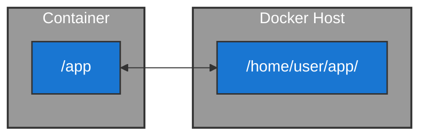
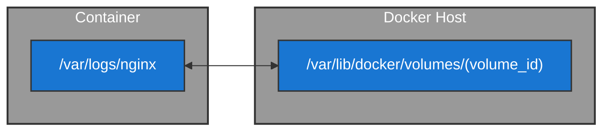
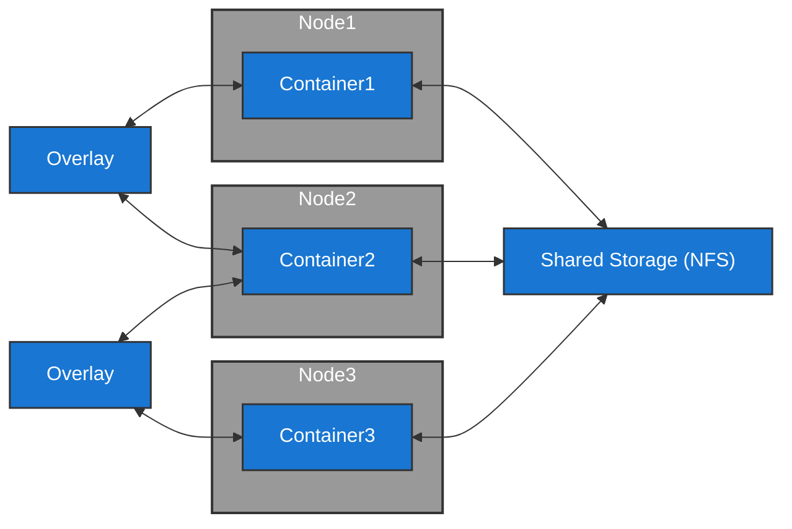

#infraestrutura/devops/containers/container/docker #infraestrutura/devops/containers/container #infraestrutura/devops

A permanência de dados em uma infraestrutura de containers é realizada por meio dos _Docker Volumes_. Sem eles, todos os dados que os containers possuem são perdidos assim que são desligados.

A seguir, veremos a respeito dos tipos de _Docker Volumes_ existentes na infraestrutura do Docker.

Este diagrama representa o ciclo de vida dos dados em containers Docker:


Aqui vemos claramente que o **ciclo de vida de um container é efêmero**, uma vez que o **armazenamento dos containers é totalmente volátil**.

Devido a essa característica, ao desenvolver aplicações para containers, é fundamental garantir que o ambiente seja _**fully stateless**_, ou seja, que o container não mantenha estado local da aplicação. Isto deverá ser feito juntamente ao offload da aplicação para quaisquer meios (databases, docker volumes, etc..) de permanência de dados provenientes da aplicação.

Dito isto, veremos os tipos de _Docker Volumes_ existentes:

1. Bind Mount:



Nesse tipo de volume, ocorre a montagem de um diretório ou arquivo do sistema host diretamente dentro do container. Este tipo é muito utilizado em ambientes de desenvolvimento onde será necessário isolamento. Um exemplo para a montagem de diretórios, é a utilização de um _Node.js_ sem a necessidade de instalação direta no host de desenvolvimento, bastando realizar um **_bind mount_ de diretório** do projeto para um container contendo o _Node.js_. Para exemplificarmos a utilidade de **montagem de um arquivo em um _bind mount_**, podemos utilizar um arquivo de configuração como, por exemplo, um _nginx.conf_ criado no host, para aplicar nas configurações de um container nginx.

2. Volume:



Neste tipo de volume, teremos a montagem similar ao _bind mount_. Porém, nesse tipo, o diretório no host é gerenciado automaticamente pelo Docker, não sendo possível definir manualmente o caminho. O seu comportamento gera a criação de um volume em _/var/lib/docker/volumes_, que será utilizado para conter seu _volume_ criado, através de um _volume_id_. Neste tipo, **a informação passada para a montagem será o nome do volume criado, e não o path do diretório escolhido**.

3. Distributed:



Neste cenário, será utilizado um storage compartilhado com base em NFS (Network Filesystem), que será responsável por armazenar todos os dados dos containers 1, 2 e 3 descritos no fluxograma. Todos esses containers são réplicas, executando instâncias idênticas da mesma aplicação. Além disso, também podemos notar que o NFS será montado em um Docker Volume, para compartilhar pela rede todos os dados das aplicações nos containers conectados ao volume, permitindo que todas as réplicas acessem os mesmos dados.

```ad-info
Além destes tipos de storage, ainda temos vários outros tipos que podem ser usados com a utilização de plugins, entre outros recursos disponibilizados para estes fins. Em casos como do _Distributed Volume_ podemos utilizar, além do NFS, soluções como _GlusterFS, Ceph, ou serviços em nuvem (EFS, Azure Files, etc.)_ para storage distribuído e persistente em ambientes de containers.
```
