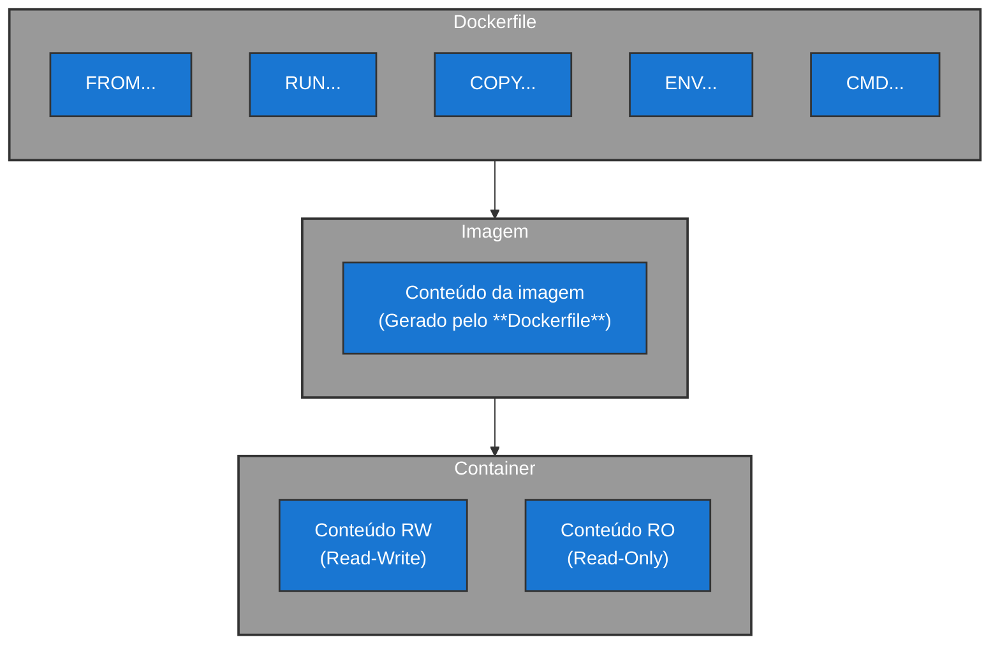

#infraestrutura/devops/containers/container/docker #infraestrutura/devops/containers/container #infraestrutura/devops #infraestrutura/devops/containers/container/dockerfile

A criação de uma imagem se dá através de um arquivo denominado como _Dockerfile_, que armazena em seu conteúdo, todas as instruções necessárias para que o Docker gere esta imagem. Logo abaixo podemos ver o fluxo do funcionamento deste passo a passo:



> ***Nota***: O _Dockerfile_ é, muitas vezes, uma responsabilidade do próprio desenvolvedor, pois o desenvolvedor é quem sabe mais sobre as necessidades de sua aplicação.

## Glossário de Diretivas Base de um Dockerfile

| **Diretiva** |                                                                   **Objetivo**                                                                    |                    **Exemplo**                     |
| :----------: | :-----------------------------------------------------------------------------------------------------------------------------------------------: | :------------------------------------------------: |
|     FROM     |                                     Responsável por apontar a imagem base (início da criação do _Dockerfile_)                                     |             FROM \<image\>:\<version\>             |
|     RUN      |         Responsável por executar um comando (geralmente para fins de configuração de ambiente ou instalação de pacotes para a aplicação)          | RUN pip install --no-cache-dir -r requirements.txt |
|     COPY     |          Responsável por copiar um arquivo de um diretório local do host utilizado na confecção do Dockerfile, para dentro do container           |              COPY requirements.txt ./              |
|     ENV      |                                   Responsável por declarar variáveis de ambiente que irão fazer parte da imagem                                   |            ENV TZ=America/Sao_Paulo<br>            |
|     CMD      | Responsável por executar um comando durante um `docker run`. Geralmente utilizado para Entrypoints (comandos que iniciam a execução da aplicação) |            CMD ["python3", "script.py"]            |

## Realizando a criação da imagem

Para realizar a criação da imagem, utiliza-se o seguinte comando abaixo:

```bash
docker build -t <app_name>:<version_tag> .
```

Esta imagem gerada será utilizada para a criação do container. O container é dividido em duas partes básicas:

1. Image: Onde o comportamento é imutável. Ou seja, Read-Only (RO/ro)
2. Container: Onde o comportamento é mutável. Ou seja, Read-Write (RW/rw)

> ***Nota***: Geralmente o _Dockerfile_ se encontra em alguma ferramenta de CI (Continuous Integration) como _Jenkins_, por exemplo, para automações.

