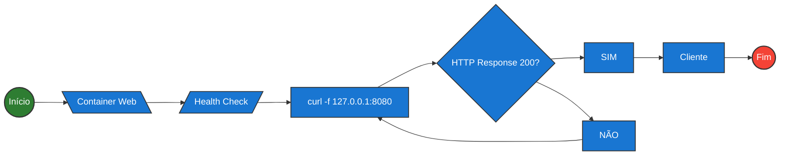

#infraestrutura/devops/containers/container/docker #infraestrutura/devops/containers/container #infraestrutura/devops #infraestrutura/devops/containers/container/dockerfile

**Health Check** é um recurso que verifica a "saúde" do container, identificando falhas que possam comprometer sua execução ou a operação da aplicação "**embedada**".

Health Checks podem ser inseridos dentro de Dockerfiles, containers ou até mesmo em um _Docker Swarm_ ou _Kubernetes_.

Um Health Check se trata basicamente de uma requisição que realiza testes em um ou mais serviços, buscando informar sua operabilidade atual. Geralmente, essas requisições ocorrem durante a execução do _docker run_ buscando o **UP** do container

Um fluxo simples para exemplificar o uso de um Health Check em uma aplicação Web em um container se dá da seguinte forma:



> Porém Health Checks não se limita ao _curl_, dependendo do tipo de aplicação desejada. Outro exemplo pode ser um teste de conexão _TCP_, onde o uso do _nc_ para testar receptividade de porta seria desejável.

Exemplo de aplicação de Health Check em um Dockerfile:

```Dockerfile
#Imagem base do NodeJS
FROM node:alpine3.21

#Identificador opcional
LABEL maintainer="ettory-martins"

#Health Check adicionado
HEALTHCHECK CMD \
	curl -sf http://localhost:3000/ || exit 1

#Criando o volume para o diretório /var/nodeapp
VOLUME [ "/var/nodeapp" ]

#Adicionando um usuário
RUN adduser -h /var/nodeapp \
	-s /bin/bash \
	-D nodeapp

#Neste caso, alterar o ownership do diretório home do usuário `node` não será necessário. Pois o usuário já será criado com o ownership de seu home correto, utilizando o `adduser` do pacote `busybox`

#Instalando curl
RUN apk add curl

#Mudança de diretório pwd
WORKDIR /var/nodeapp

#Cópia de arquivo da aplicação para ".", que nesse caso é o WORKDIR
COPY app.js .

#Alterando permissões do arquivo da aplicação
RUN chown nodeapp:nodeapp app.js

#Utilização da cláusula ARG
ARG VERSION

#Definição de valor default (caso não seja informado no build)
ENV VERSION=${VERSION:-1.0.0}

#Realizando troca de usuário
USER nodeapp

#Executa a aplicação
CMD [ "node", "app.js" ]
```

Aplicação de teste:

```javascript
const http = require('http');
const hostname = '0.0.0.0';
const port = process.env.PORT;
const version = process.env.VERSION;
const server = http.createServer((req, res) => {
  res.statusCode = 200;
  res.setHeader('Content-Type', 'text/plain');
  res.end('Hello World');
});

server.listen(port, hostname, () => {
  console.log(`Server running at http://${hostname}:${port}/ and version ${version}`);
});

process.on('SIGINT', function() {
    process.exit();
});
```

## Exemplo com uma aplicação em Python + Flask

```python
#!/usr/bin/env python3

from flask import Flask
from os import getenv
from requests import get

import json

app = Flask(__name__)

@app.route('/')
def hello():
	return """
<!DOCTYPE html>
<html lang="en">
<head>
	<meta charset="UTF-8">
	<title>FlaskApp!</title>
</head>
<body>
	<h1> DEMO </h1>
</body>
</html>
"""

@app.route('/health')
def health():
	return "HEALTHY", 200

if __name__ == '__main__':
	app.run(host='0.0.0.0')
```

```Dockerfile
#Dockerfile.python
FROM python:3

EXPOSE 5000

WORKDIR /flask_app

RUN pip install requests flask

COPY app.py .

HEALTHCHECK CMD --interval=30s --timeout=5s --retries=3 \
	curl -sf localhost:5000/health || exit 1

CMD ["flask", "run", "--host", "0.0.0.0"]
```

Execução:

```bash
docker build -t python-healthcheck:1.0 -f Dockerfile.python .
docker run python-healthcheck:1.0
```
