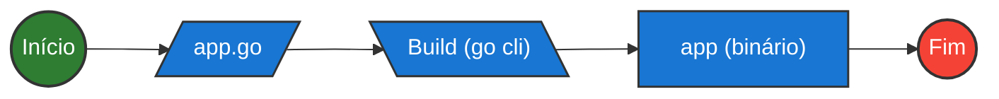

#infraestrutura/devops/containers/container/docker #infraestrutura/devops/containers/container #infraestrutura/devops #infraestrutura/devops/containers/container/dockerfile #infraestrutura/devops/containers/container/multistaging

A técnica de multi-staging é utilizada para fins de aprimoramento e shrink (encolhimento) de Docker Images. Geralmente, é utilizada em 2 estágios de build dentro do Dockerfile. É executado desta forma, visando a **separação entre os steps (passos) de _build_ e runtime**.

No step de build é gerado um artefato (binário da aplicação), e todo o resto dos arquivos podem ser automaticamente descartados, gerando maior leveza e performance maior para a imagem. Pois a imagem só irá realizar a interpretação direta do binário da aplicação desejada.

> Nos exemplos dessa técnica, será utilizada a linguagem Golang, pelo fato de seu funcionamento ser realizado por meio de compilação (gera um artefato binário para execução posterior).

## Multi-Stage Builds

O que uma aplicação em Golang precisa para ser executada?



Ou seja, a imagem é dividida entre as etapas de _build_ e _runtime_.

Neste cenário, foi atestado que a etapa de **build não se trata de algo necessário** para a execução da aplicação, e sim **algo fundamental apenas para sua construção**. Isso gerou o desacoplamento do artefato _app.go_ e _app (binário)_ em duas etapas distintas, junto a exclusão da etapa de _build_ da própria linguagem Golang, em sua CLI (Command Line Interface).

## Como criar um Dockerfile utilizando multi-stage

O Dockerfile será dividido em duas partes. Sendo que a primeira irá referenciar uma imagem base maior, com a cláusula _FROM_, e a segunda irá referenciar uma imagem menor (bruta - geralmente **docker scratch image**) utilizando uma segunda cláusula _FROM_. Exemplo didático (**Não executável!!!**):

```Dockerfile
FROM golang-debian:1.17 AS builder
RUN go build
COPY app

FROM scratch
COPY --from=builder
CMD [ "app" ]
```

Neste exemplo, a primeira etapa é feita apenas para geração do binário (compilação), e logo depois é descartada, enquanto a segunda etapa é a imagem real (para deploy em produção). Isso gera melhorias para tamanho de uma imagem.

## Dockerfile Golang Real

Aplicação Golang de exemplo:

```go
//app.go
package main

import {
	"fmt"
	"net/http"
	"os"
}

func handler(w http.ResponseWriter, r *http.Request){
	var name, _ = os.Hostname()
	
	fmt.Fprintf(w, "<h1>This request was processed by host: %s</h1>\n", name)
}

func main(){
	fmt.Fprintf(os.Stdout, "Web Server started. Listening on 0.0.0.0:80\n")
	http.HandleFunc("/", handler)
	http.ListenAndServe(":80", nil)
}
```

Dockerfile de exemplo:

```Dockerfile
#--------  STAGE 1: Compilation Step --------  

#Imagem base do Golang Debian
FROM golang:1.18.0-bullseye AS builder

#Mudança de diretório corrente
WORKDIR /app

#Copia a aplicação para o workdir
COPY app.go .

#Inicializa o módulo Go e cria o binário da aplicação com embedding de libs de dependência
RUN go mod init main && \
	CGO_ENABLED=0 GOOS=linux GOARCH=amd64 go build -o main

#--------  STAGE 2: Runtime Step -------- 

#Imagem vazia (não possui utilitários, porém executa o binário gerado no STAGE 1)
FROM scratch

#Porta exposta
EXPOSE 80

#Copia o binário da imagem com alias "builder"
COPY --from=builder /app/main /go/main

#Execução do binário
CMD [ "/go/main" ]
```

Execução:

```bash
docker build -t golang:multistaging .
docker run -d golang:multistaging
```


O shrink da imagem foi realizado e o resultado se encontra logo abaixo:

* Sem otimização (imagem full):

```bash
REPOSITORY                    SIZE
golang:1.18.0-bullseye        970MB
```

* Depois da otimização (multi-staging):

```bash
REPOSITORY             SIZE
golang:multistaging    6.24MB
```
