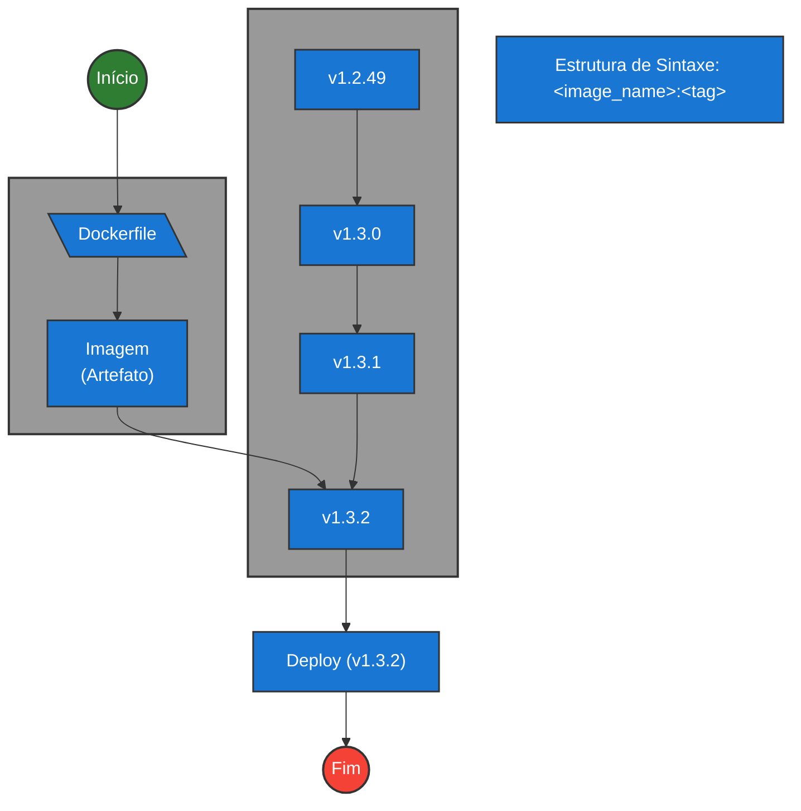

#infraestrutura/devops/containers/container/docker #infraestrutura/devops/containers/container #infraestrutura/devops #infraestrutura/devops/versionamento

Alguns pontos importantes do motivo de utilização das tags:

* Rastreabilidade de artefatos
* Versionamento (convenção comumente utilizada: [Semantic Versioning (SEMVER)](https://semver.org/lang/pt-BR/)):
	* SEMVER:
		* Estrutura de sintaxe - x.x.x:
			1. MAJOR version quando gera modificação de API e isto causa incompatibilidade
			2. MINOR version quando adiciona uma nova feature (funcionalidade/recurso)
			3. PATCH version quando gera correção de bug

## Como utilizar tags?

* Padrão comum de versionamento com tags utilizando Git (permite melhor rastreabilidade):

